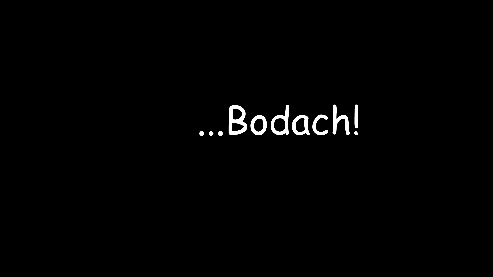
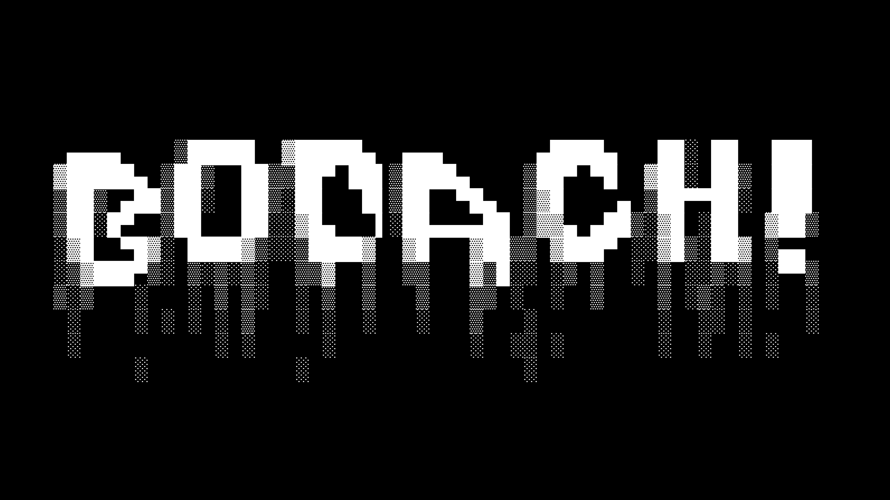
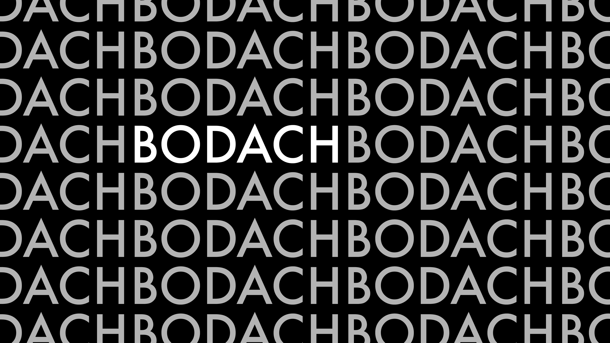
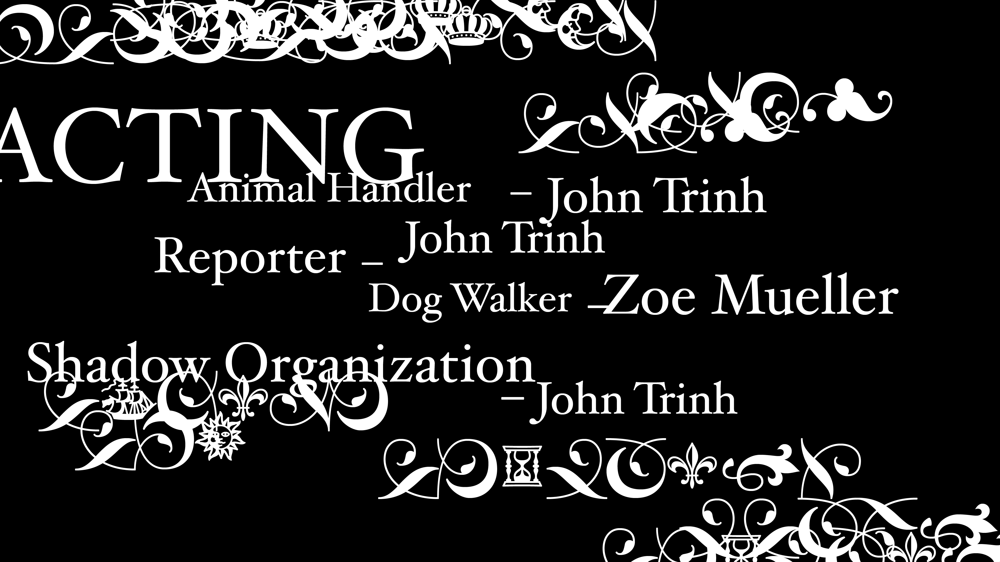

<video controls width="100%">
  <source src="video.mp4" type="video/mp4">
  Your browser does not support the video tag.
</video>

short film made with friends. originally for north springs charter high school film festival in 2022, but it was cancelled and we were very disappointed about that.

BODACH is incredibly dumb in concept but aesthetically superb, if i say so myself.

main contributions:
concept
graphic design

original score

sound design
audio editing

acting
