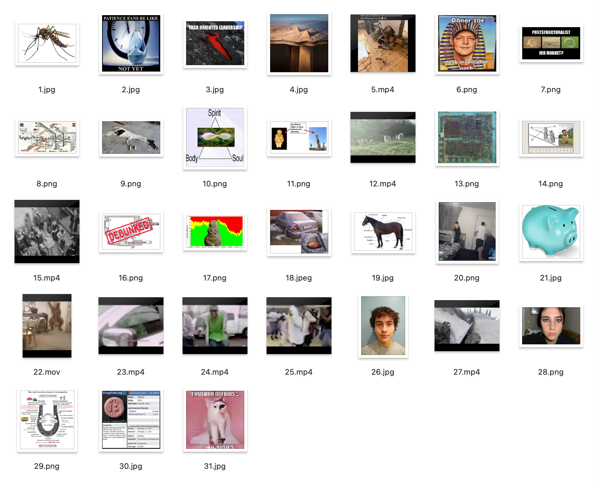
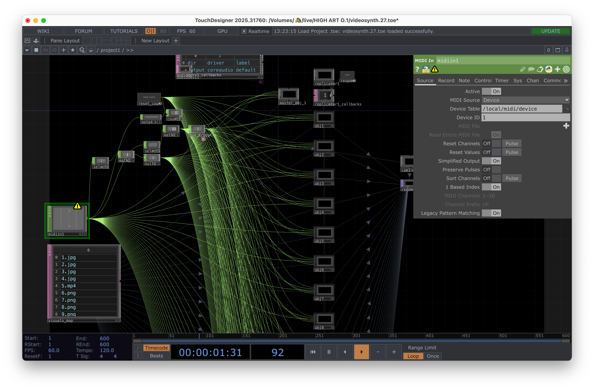

@[youtube](g_kIuch5jUA)

collaboration with [francesca gautreau](https://www.instagram.com/francesca.gautreau). (<3)

performed for a public showcase event at riverside studios in berlin. product of a performance class taught by [colin self](https://www.instagram.com/colinself).

## the concept

midi keyboard. each note is a distinct visual/sound artifact. press and hold a note to play the artifact. pitch bend pitches audio up/down and speeds/slows video playback. modwheel is an intensity dial, a concept i love using in every live performance. pull it up to make stuff louder and dial in effects!

running bits is also an integral part of the performance. francesca and i are who we are and this is what we do

1. tag-teamed red bull can
2. jelly donut (in berlin they call them berliner donuts, which i don't like. why are they claiming jelly donuts??)
3. making out with the jelly donut between us
4. eating the paper bag the donut was in (unplanned)
5. notebook and fake scribbles
6. walking through the crowd and grabbing a slice of pizza from the back

## process

5 am. performance due for public showing the next day. francesca and i are sitting in a room. she is making visuals and curating more. i am trying to figure out how to technically pull our idea off. i download resolume because i thought i couldn't pull off the touchdesigner rig in time. resolume is a big mistake and has no free version.

VISUAL RIG IS ALL TOUCHDESIGNER BABY!! i threw it together in like four hours. didn't know how to use touchdesigner very well. especially didn't know how to do 3d in there, which this required (best way for dynamic z axis, to show each newest artifact on top)

for the still images' audio, francesca set up simplers in a drum rack in ableton live. i think this was her first time doing this and it was probably very stressful because we were throwing that together like an hour before rehearsal. but we preservered and it was beautiful.

we wanted to play the original audio from video clips, so we couldn't figure out how to easily set it up through ableton live. i ended up sending the video audio directly through touchdesigner to the audio interface. in hindsight could use blackhole to route from td into live and allow it to be processed along with the drum rack output. oh well
