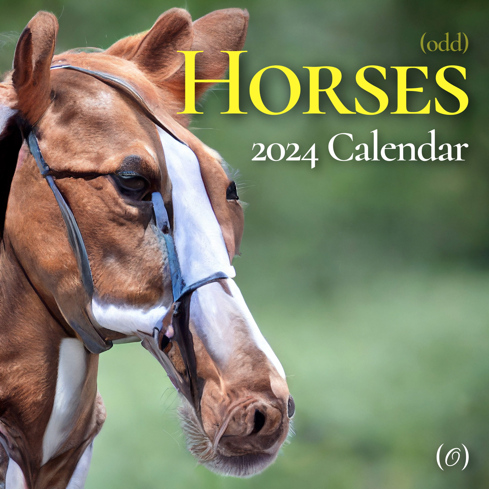
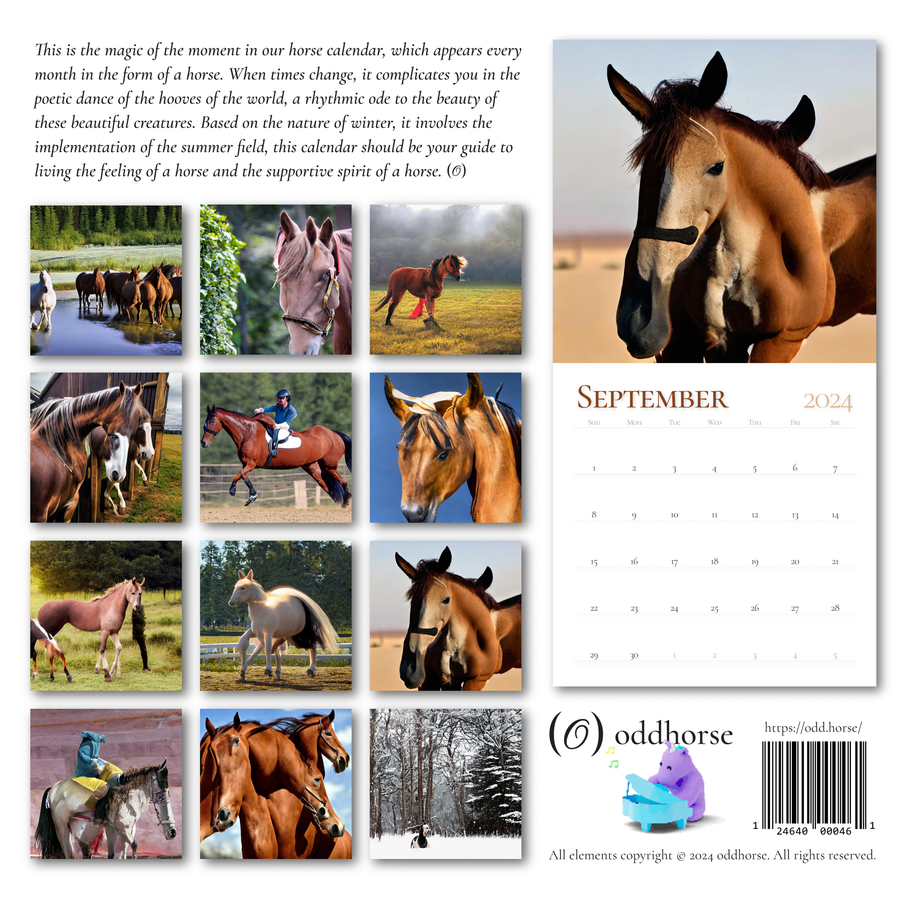
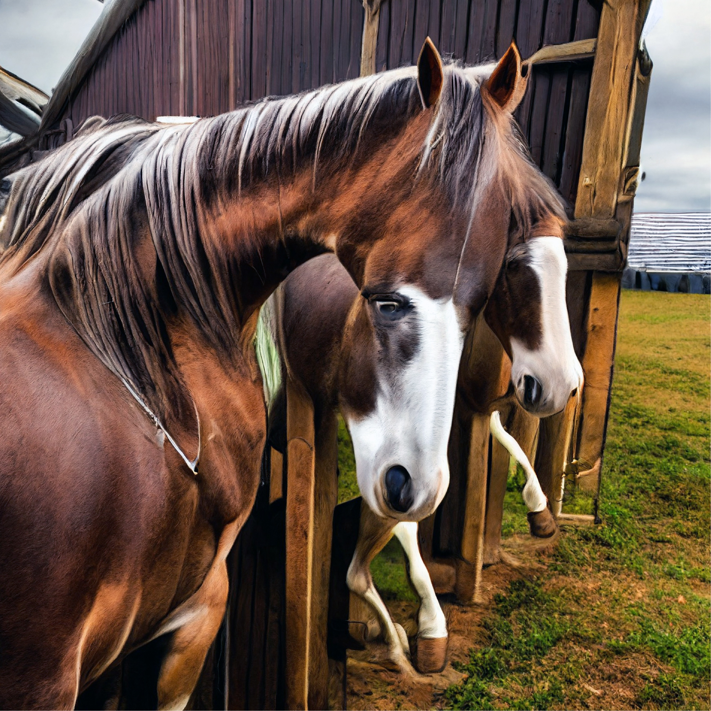
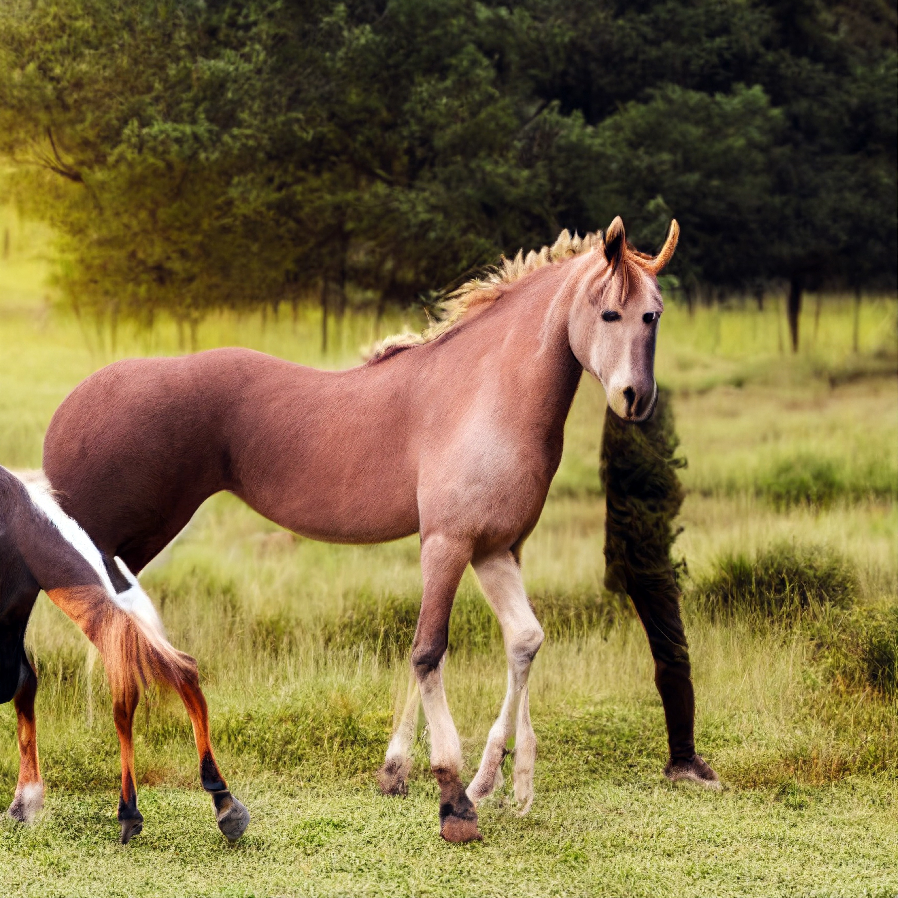
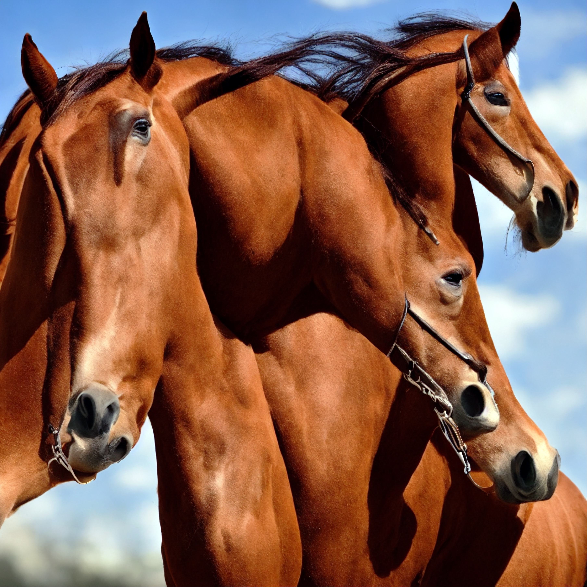

a perversion of horse calendars for horse girl types. odd horses, if you will! made as merch for oddhorse; sold in limited run at printed matter in nyc; displayed in nyu gallery night in late 2024.

i love the look of incompetent gen-ai images. there's this frightened, stroke-induced look to them that humans just can't ever create ourselves. the nay-sayers claim that using ai to make art is in all cases unoriginal and therefore not honorable. what about incorporating ai's characteristic flaws into the art itself? let's shut up with the theory and see some odd horses.

the most difficult part of this project was combating the "shiny" look of most consumer-friendly ai image generators. this look is due to aggressive cleaning of training data. it just doesn't know about images that kinda look like shit—like reality!

the key to this was using models that weren't trained like that; mostly old models that aren't ever deployed for consumer use anymore. luckily, these models are generally small and easy to run on my personal machine!

the second issue was image size. i had to test every upscaling model and workflow and multi-step technique out there, because most of them turned out to be really bad!

i'm so proud of the realism and detail of these pictures. try making something like this yourself! it's shockingly hard with the "most advanced" tools we have today.
